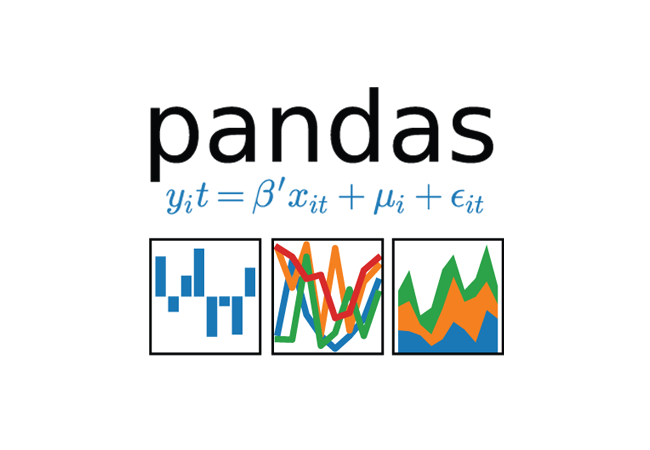

## Random Forest with sklearn


The python library **scikit-learn** is a dependable collection of tools that are among the easiest and most user-friendly packages there are. It's built on numpy and scipy, so if you are comfortable with python, this will be one of your first stops. For those who are newer to machine-learning, there's a good chance that you learned how to build models with this package.
<br clear="left"/>

### THE SCOOP
A model built with **scikit-learn is lightweight and portable**. This makes it a good candidate for being *deployed via API in a docker container*. If your scoring job is extrememly large or feature extraction is complex, this model alone won't help you, but you can achieve scaling with a tool like Kubernetes orchestrating those containers. On the training side, it's a **good choice for a quick-and-dirty model that gives you a good baseline without custom coding**. Why should you re-write the steps to calculate AUC when it's already done for you? You can always paste the code into a notebook if command-line interfaces aren't your thing. 
<br/>

### THE SET-UP


Setup for this example is minimal. We use the pandas library which makes the data manipulation much easier and further reduces code. Below is a quick test to show if you have the right libraries. If python complains, use pip install <library>, or have your cluster admin do(or sudo) it for you.
<br clear="right"/>

```
python 
Python 3.6.3 (default, Mar 20 2018, 13:50:41) 
[GCC 4.8.5 20150623 (Red Hat 4.8.5-16)] on linux
Type "help", "copyright", "credits" or "license" for more information.
>>> import sklearn, pandas, joblib
>>> 
```

### THE RUN
To run the script, simply execute it with python. It doesn't get easier than that. Selected output appears below:
```
python rf.py 

Raw Data Summary: 
             target            f1            f2  ...           f10           f11           f12
count  10000.000000  10000.000000  10000.000000  ...  10000.000000  10000.000000  10000.000000
mean       0.244200      0.009014      0.011106  ...      0.039972      0.018248     -0.042597

Modeling Populations: 
Train X & Y Shape ::  (6000, 12) (6000,)
Test X & Y Shape ::  (4000, 12) (4000,)

Trained model :: 
RandomForestClassifier(bootstrap=True, class_weight=None, criterion='gini',
            max_depth=5, max_features='auto', max_leaf_nodes=None,
            min_impurity_decrease=0.0, min_impurity_split=None,
            min_samples_leaf=1, min_samples_split=2,
            min_weight_fraction_leaf=0.0, n_estimators=500, n_jobs=None,
            oob_score=False, random_state=None, verbose=0,
            warm_start=False)

Feature Importances: 
f1 0.08698154450445926
...

AUC for Testing Data: 
0.5
```
<br/>

Don't expect much performance if you use the synthetic data. An AUC of 0.5 = ML equivalent of a coin flip. Additionally, there is a file created called **rfmodel.joblib** that is written using joblib. This model can be used for deployment.

### THE WRAP-UP


