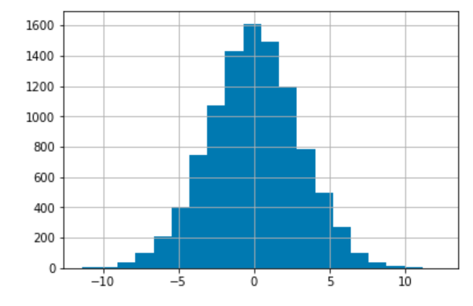
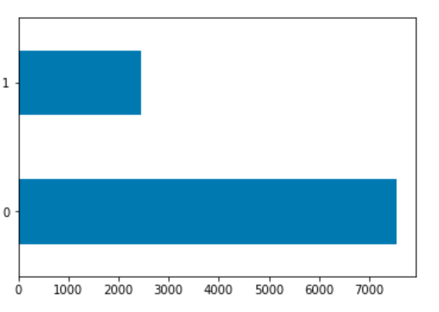

## Random Forest with TensorFlow


The python library **scikit-learn** is a dependable collection of tools that are among the easiest and most user-friendly packages there are. It's built on numpy and scipy, so if you are comfortable with python, this will be one of your first stops. For those who are newer to machine-learning, there's a good chance that you learned how to build models with this package. This is also a really good choice to estimate the degree to which your problem can be solved or quick feature assessments. 

<br clear="left"/>

### THE SCOOP

<br/>

### THE SET-UP


<br/>
 
<br clear="right"/>

```
python
Python 3.6.3 (default, Mar 20 2018, 13:50:41) 
[GCC 4.8.5 20150623 (Red Hat 4.8.5-16)] on linux
Type "help", "copyright", "credits" or "license" for more information.
>>> import tensorflow as tf
>>> print(tf.__version__)
1.13.1
>>> import sklearn, pandas, numpy, matplotlib
>>> ctrl-d
```

### THE RUN
Open the jupyter notebook and play the cells. Selected output:
```
Size of training:    6000
Size of evaluation:  4000

First row of training predictors (numpy) array:
[ 4.35532638  7.69822162  4.05488623 -0.05420009 -0.86838503  2.85506864
  4.23377396 -0.38211895 -1.38040518  5.71197681  4.73818419 -0.99729902]

Step 1, Loss: -1.000000, Acc: 0.750167
Step 10, Loss: -21.000000, Acc: 0.750167
Step 20, Loss: -21.000000, Acc: 0.750167
Step 30, Loss: -21.000000, Acc: 0.750167
Step 40, Loss: -21.000000, Acc: 0.750167
Step 50, Loss: -21.000000, Acc: 0.750167

Test Accuracy: 0.76425
```
Since we're using a notebook, we can use visualization tools. Here are a some graphs you might see:
<p align="middle">
   
  
</p>
<br clear="middle"/>


Don't expect much performance if you use the synthetic data. An AUC of 0.5 = ML equivalent of a coin flip. Additionally, there is a folder created called **./checkpoints** that contains checkpoints for models written out every 10 epochs. This model can be used for deployment.

### THE WRAP-UP
