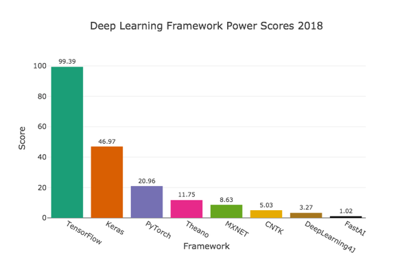

## Tensor Forest with TensorFlow


**TensorFlow** (TF) is an open-source library that focuses on developing and training ML models. The **types of models that TF excels in have architectures based on neural networks**. Networks are developed by adding layers between the input and the output. Depending on the types of layers added, these networks can handle different types of problems, like a CNN (Convolutional Neural Network) for image classificaiton or RNN (Recurrent Neural Network) for forecasting a time series. 
<br/>
Some would say that TensorFlow is difficult to use. Keras is a high-level API that makes it easier to construct complex models by adding levels with less code. The tensors that give TensorFlow its name are mathematical entities that are very good for large, fast calculations. If you have **access to a GPU, TensorFlow is positioned to take advantage** of that. It is also a very popular package among data scientists - see figure below - so it appears that TensorFlow is worth investing some time to learn. 

<br clear="left"/>



<br clear="middle"/>

### THE SCOOP
A model built with **scikit-learn is lightweight and portable**. This makes it a good candidate for being *deployed via API in a docker container*. If your scoring job is extrememly large or feature extraction is complex, this model alone won't help you, but you can achieve scaling with a tool like Kubernetes orchestrating those containers. On the training side, it's a **good choice for a quick-and-dirty model that gives you a good baseline without custom coding**. Why should you re-write the steps to calculate AUC when it's already done for you? You can always paste the code into a notebook if command-line interfaces aren't your thing. 

### THE SET-UP


Setup for this example is minimal. We use the pandas library which makes the data manipulation much easier and further reduces code. Below is a quick test to show if you have the right libraries. If python complains, use pip install <library>, or have your cluster admin do(or sudo) it for you. <br/>
<br/>
Isn't MapR a distributed file system? And don't you need special commands to interact with distributed file systems? It is but you don't, because MapR's file system is POSIX-compliant. You can run any program that work on Linux without modification!   
<br/>
 
<br clear="right"/>

```
python
Python 3.6.3 (default, Mar 20 2018, 13:50:41) 
[GCC 4.8.5 20150623 (Red Hat 4.8.5-16)] on linux
Type "help", "copyright", "credits" or "license" for more information.
>>> import tensorflow as tf
>>> print(tf.__version__)
1.13.1
>>> import sklearn, pandas, numpy, matplotlib
>>> ctrl-d
```

### THE RUN
Open the jupyter notebook and play the cells. Selected output:
```
Size of training:    6000
Size of evaluation:  4000

First row of training predictors (numpy) array:
[ 4.35532638  7.69822162  4.05488623 -0.05420009 -0.86838503  2.85506864
  4.23377396 -0.38211895 -1.38040518  5.71197681  4.73818419 -0.99729902]

Step 1, Loss: -1.000000, Acc: 0.750167
Step 10, Loss: -21.000000, Acc: 0.750167
Step 20, Loss: -21.000000, Acc: 0.750167
Step 30, Loss: -21.000000, Acc: 0.750167
Step 40, Loss: -21.000000, Acc: 0.750167
Step 50, Loss: -21.000000, Acc: 0.750167

Test Accuracy: 0.76425
```
Since we're using a notebook, we can use visualization tools. Here are a some graphs you might see:
<p align="middle">
   
  
</p>
<br clear="middle"/>


Don't expect much performance if you use the synthetic data. An AUC of 0.5 = ML equivalent of a coin flip. Additionally, there is a folder created called **./checkpoints** that contains checkpoints for models written out every 10 epochs. This model can be used for deployment.

### THE WRAP-UP
There are three basic flavors of deploying the model you just wrote out to the MapR file system:
1. For small to medium batches, simply **run it as a python script, possibly scheduled with crontab**.
1. For real-time scenarios, download the **mapr_streams_python library, stream your features through a Producer, and then add the model in your Consumer**
1. For meeting serious SLA's and heavy workloads, put the model into a **lightweight container, serve it with an API such as Flask, then orchestrate with Kubernetes** to meet demands of the workload.

<p align="middle">
   
  
  
</p>
