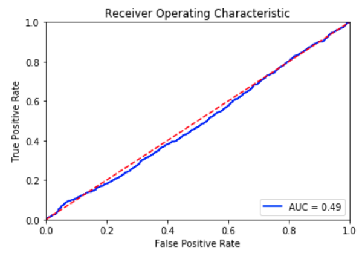
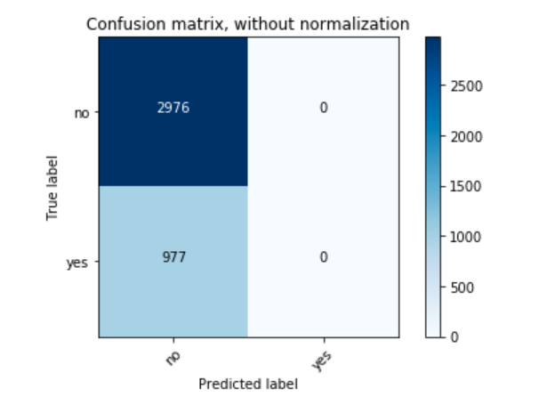

## Random Forest with Spark, scala application and pyspark


**Apache Spark** is the powerhouse compute engine of distributed data platforms. If you've ever needed to move a lot of distributed data around a cluster (i.e. a legit big data workflow), it's likely you've come across Spark. There are lots of ways to interact with Spark and it seems like there are more in every new release. If you like to write compiled code, you have **scala** and **java** options, plus the scala command-line shell. There are also API's for python (i.e. **pyspark**) and **R**. You can also write Spark code in notebooks too. You'll find an example below. <br/>
<br/>
Another key selling point of Spark is the included libraries, including **Spark Streaming, MlLib, Spark SQL and GraphX**. You can test your code in local mode before deploying in yarn mode when you're working on a cluster, which makes this the first choice of most big data developers. 
<br clear="left"/>

### THE SCOOP


A model developed with **Spark's ML Pipelines** is very portable within Spark workflows and that makes it the ideal choice for big-data modeling jobs, as well as a model that integrates readily into Spark Streaming workflows for real-time implementations. Spark is a good choice **when the training data is exceptionally large** (i.e. 100M's of rows) or the **features being extracted are especially onerous** (e.g. vectorizing text from 1M documents and vocab size of 2M+). These are the types of problems where other methods may fail and cause limitations to be imposed on the data scientist. <br/>
<br/>
Using **pyspark** with jupyter is **ideal for the data scientist who prefers python but has a big data problem** that is vexing their current environment. 
<br clear="right"/>

### THE SET-UP
There are two options for building the random forest presented here with Spark: pyspark with jupyter and submitting as a scala application. You could also use the spark-shell or another notebook. You could also invoke SparkR and run R code. 
#### pyspark
To run the pyspark notebook, you'll need jupyter and a few libraries (have an admin install with pip or sudo it yourself). You'll also need to set your SPARK_HOME environment variable so python knows where to find it. Once that's ready, launch the notebook.
```
export SPARK_HOME=/opt/mapr/spark/spark-2.3.2/
echo $SPARK_HOME
/opt/mapr/spark/spark-2.3.2/
python 
Python 3.6.3 (default, Mar 20 2018, 13:50:41) 
[GCC 4.8.5 20150623 (Red Hat 4.8.5-16)] on linux
Type "help", "copyright", "credits" or "license" for more information.
>>> import findspark, sklearn, matplotib, numpy, itertools
>>> ctrl-d
jupyter notebook
```

#### scala app
For this option, we need to compile the source code. You must have sbt loaded to build the jar file. Make sure your spark and scala versions match what's in the file **build.sbt**.
```
cat build.sbt 
  scalaVersion := "2.11.8"
  val sparkVersion = "2.3.2"
sbt package
[info] Done packaging.
[success] Total time: 24 s, completed Apr 30, 2019 3:57:21 PM
```
If your code worked, it should create a jar in the local folder **./target/scala-2.11/** which we will need to run the code in the next step.

### THE RUN
The two implementations appear very different but are similar under the hood. Both are using Spark's ML Pipelines. 
#### pyspark
Running the notebook is as simple as pressing play and watching. There are a few things you might need to change:
1. Change the location of the csv to '/user/mapr/**user**/RandomForestVariations/sample10k.csv'
1. You might need to replay a cell if the figure isn't showing up  

Once you get it running, you might see some output like this:
```
+---------------+-----+--------------------+
|             id|label|            features|
+---------------+-----+--------------------+
|523T0KGIWNKIJ9P|  1.0|[-4.5667211344624...|
|A7GO61NB4SVQVMW|  0.0|[-1.6045449181362...|
...
+---------------+-----+--------------------+

Col 	 Relative Importance
f1 	 0.08361246769651286
...
f12 	 0.07742582169768518
```

Images produced may resemble this lackluster ROC and confounding confusion matrix:
<p align="middle">
   
  
</p>
<br clear="middle"/>

#### scala 
After you've built the application, you can submit the job. The basic usage is below:
```
spark-submit --class <package>.Main  <path_to_jar_file> <path_to_input_file>
```
Here is how to run it and some of the expected output; for the input file, make sure you change the user folder to your own...
```
head -1 src/main/scala/RandomForest.scala 
package com.mapr.randomforest 
ls ./target/scala-2.11/*.jar
./target/scala-2.11/randomforest_2.11-0.1.0-SNAPSHOT.jar
/opt/mapr/spark/spark-2.3.2/bin/spark-submit --class com.mapr.randomforest.Main ./target/scala-2.11/randomforest_2.11-0.1.0-SNAPSHOT.jar /user/<user>/RandomForestVariations/sample10k.csv
Sample of Input Data...
...

Feature Importance for Random Forest...
(f1,0.07720917704516188)
(f2,0.08586758745064019)
...

AUC for Random Forest (test set) ...
0.49880152464352806
```

Don't expect much performance if you use the synthetic data. An AUC of 0.5 = ML equivalent of a coin flip. 

### THE WRAP-UP


<p align="middle">
   
</p>
<br clear="middle"/>
