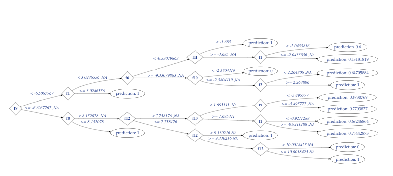

# ML Variations on MapR - Random Forest (RF)


*If a decision tree fails in a random forest and no one is monitoring it, does it impact performance?*  The data scientist today has an embarrassment of riches for machine-learning libraries. It would be a classic buyer's market if most of these tools weren't already open-sourced. Selecting the right tool to get good performance used to be the key decision a data scientist would struggle with - we're seeing a seismic shift to focusing on how it gets deployed. After all, that is the **only** way in which the value of a machine-learning model is realized. <br/>
<br/>
If you have a data platform on which you can wield many tools and the flexibility to deploy your models the way you want to, the actual choice of tool can almost be incidental. To show that concept in action, we've loaded many libraries and tools onto **the MapR Data Platform** to illustrate how the same model training can be done in a variety of ways, depending on things like size, speed and user preference.
<br clear="left"/>

## Why Random Forest?


There are many categories of machine-learning problems and the goal of the solution you're trying to build will determine which algorithms are appropriate. Classification is part of the O.G. family of ML problems  (along with estimation / forecasting and clustering) but there are many others. If you're an experienced data scientist, you've probably built a few binary classification models in your day. <br/>
<br/>
The **Random Forest** algorithm takes a very simple component (i.e. the binary decision tree) and extends it very powerfully by building many trees (ahem, like a forest...) and constantly sampling among the observations and features. This allows the data scientist to explore non-linear patterns in the data but also provides the robustness of linear estimators. It's unique in that the more you train, *the less chance that over-fitting has occurred*. You should use lots of methods to run lots of experiements to find the model (or the ensemble) with the best performance.
<br clear="right"/>
<br/>
An example of one forest tree is here - we're going to build hundreds, thousands of these: 


## The Machine-Learning Workflow with RF


The purpose of performing the same model-training with multiple tools is to demonstrate that there is sufficient variability of the MapR platform to support all these tools. **Once the choice of tools is no longer constrained, you start thinking about overcoming the limits surrounding deployment of the models you're building.** <br/>
<br/>
The results of these exercises will not be usable since we're using synthesized data. But don't call a lumberjack or start slashing and burning right away. *You can determine which tools are right for you based on your environment and deliverables and replace your own data*. In each section, there are tips about which situations that each tool is ideal for and some next steps (i.e. deployment). 
<br clear="left"/>
<br/>
Here are the steps we'll perform on each of these variations. If the tool allows for visualization, we'll explore that too: <br/>
1. **Read in CSV** file containing label and numeric features, split 60/40
2. **Train RF model** on training set with 500 trees and max-depth of each tree=5
3. **Interpret the Model** with Feature Importance
4. **Evaluate the model** on our holdout set with the AUC (Area-under-the-ROC) 

## Vary the tools but not the Environment


Your choice of ML tools shouldn't be the first thing you decide. *It should be one of the last*. Focus on the delivery of your solution, then pick the right workflow that will best achieve that delivery, thus giving you the best chance to provide the value. Isn't that what you get paid for? <br/>
<br/>
The variations on Random Forest included with this content should give you some ideas about when each method is appropriate. Click on the links in the repo to read more about each one. All of the code is meant to run on a **MapR 6.1 Platform** - I've provided the versions of all the tools I've used and any extra libraries that need to be added, usually done with one or two commands. 
<br clear="left"/>
Here's how to get the code quickly onto your MapR cluster: <br/>

```
cd /user/<user>
git clone https://github.com/joebluems/RandomForestVariations.git
cd RandomForestVariations
```
<br/>
PS - made it through the whole post without resorting to using the metaphor "seeing the forest for the trees..."!

